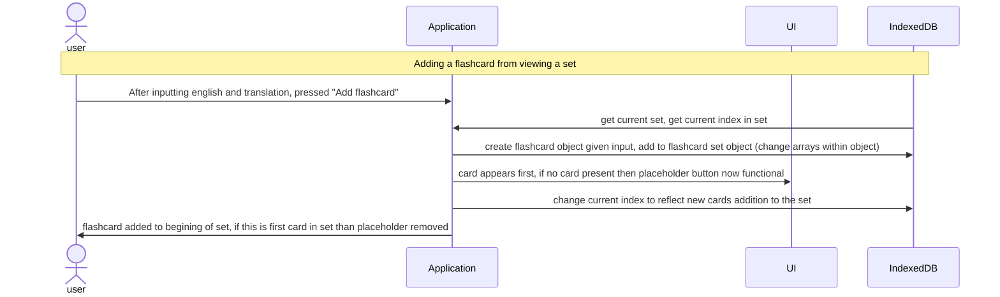

```mermaid
  sequenceDiagram
  actor user
  participant app as Application
  participant ui as UI
  participant db as IndexedDB

  Note over user,db: Adding a flashcard from viewing a set
  user->>app: After inputting english and translation, pressed "Add flashcard" 
  db->>app: get current set, get current index in set
  app->>db: create flashcard object given input, add to flashcard set object (change arrays within object)
  app->>ui: card appears first, if no card present then placeholder button now functional
  app->>db: change current index to reflect new cards addition to the set
  app->>user: flashcard added to begining of set, if this is first card in set than placeholder removed
```
