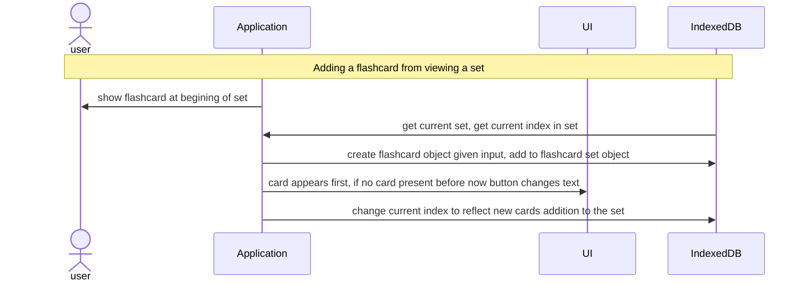

```mermaid
  sequenceDiagram
  actor user
  participant app as Application
  participant ui as UI
  participant db as IndexedDB

  Note over user,db: Adding a flashcard from viewing a set
  app->>user: show flashcard at begining of set
  db->>app: get current set, get current index in set
  app->>db: create flashcard object given input, add to flashcard set object
  app->>ui: card appears first, if no card present before now button changes text
  app->>db: change current index to reflect new cards addition to the set
```
