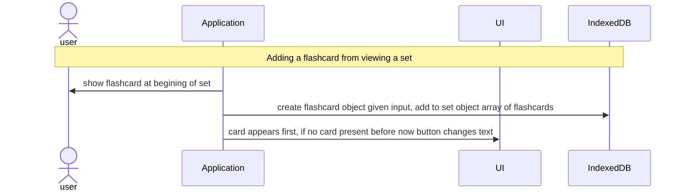

```mermaid
  sequenceDiagram
  actor user
  participant app as Application
  participant ui as UI
  participant db as IndexedDB

  Note over user,db: Adding a flashcard from viewing a set
  app->>user: show flashcard at begining of set
  app->>db: create flashcard object given input, add to set object array of flashcards
  app->>ui: card appears first, if no card present before now button changes text
```
